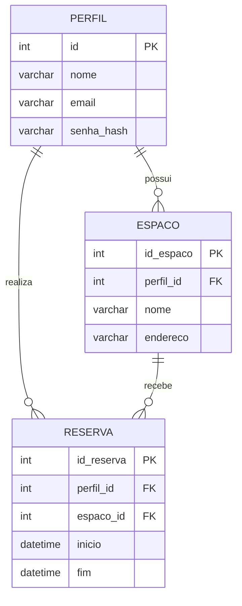

# Espaco-Conecta
Projeto acadêmico da instituição SENAC , com foco na criação de uma aplicação para gerenciamento de um espaço de coworking.

📌 Objetivo

Desenvolver uma aplicação completa com:

Integração com banco de dados

Interações dinâmicas nas páginas

Separação entre frontend, backend e banco de dados

🏗️ Estrutura do Projeto

/Espaco-Conecta

├── /frontend

├── /backend 

├── /database

└── /docs

🛠️ Tecnologias Utilizadas

Frontend: HTML, CSS;

Backend: JavaScript, PHP;

Banco de Dados: SQL;

⚙️ Funcionalidades

Cadastro de usuários

Login

Reserva de espaços

Gerenciamento de horários

Integração com banco de dados

## 📊 Modelo Entidade Relacionamento

📚 Aprendizados

Este projeto tem como objetivo aplicar conhecimentos em:

Desenvolvimento web

Integração com banco de dados

Organização de projetos

👨‍💻 Participantes:

[Maykon Rodrigues](https://github.com/Dev-Maykon)

[Augusto Mangano Costa](https://github.com/mangacosta4-ai)

[Bruno Martins](https://github.com/Brunomartins-web)

